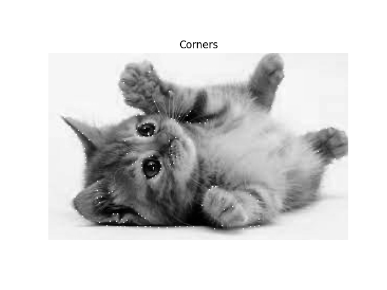
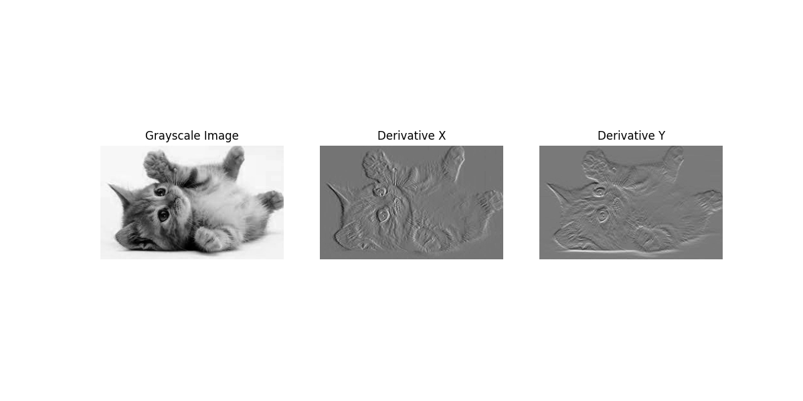

# Harris Corner Detection

## Description

This Python script implements the Harris Corner Detection algorithm to identify corner points within an image. It converts the input image to grayscale, calculates derivatives, and then computes the Harris response to identify corner points. The script visualizes the results and measures the execution time of the core function.


## Features

- Converts an input image to grayscale for analysis.
- Calculates the x and y derivatives of the image.
- Applies the Harris Corner Detection algorithm to identify corner points.
- Visualizes the grayscale image, derivatives, and identified corners.
- Measures and reports the execution time of the corner detection function.

## How It Works

### Grayscale Conversion
- The input image is converted to grayscale to simplify the analysis.
``` python
for i in range(height):
    for j in range(width):
        gray_image[i, j] = b[i, j] * 0.299 + r[i, j] * 0.587 + g[i, j] * 0.114

```
### Derivative Calculation
- Calculates the x and y derivatives of the grayscale image to prepare for corner detection.
```python
derivative_x = np.gradient(gray_image, axis=1)
derivative_y = np.gradient(gray_image, axis=0)
```


### Harris Corner Detection
- Computes the Harris response from the image derivatives to identify corner points.
```python
harris_response = det_M - k * (trace_M ** 2)
```

### Corner Identification
- Computes the Harris response from the image derivatives to identify corner points.
```python
 for i in range(2, height - 2):
        for j in range(2, width - 2):
            if harris_response[i, j] < T:
                local_min = harris_response[i - 2:i + 3, j - 2:j + 3]
                if harris_response[i, j] == local_min.min():
                    corners.append((i, j))
```
### Conclusion
This simulation showcases the basic principles of object-oriented programming, linear transformations, and data visualization in Python. It provides a foundation for more complex simulations involving moving entities and their interactions.

